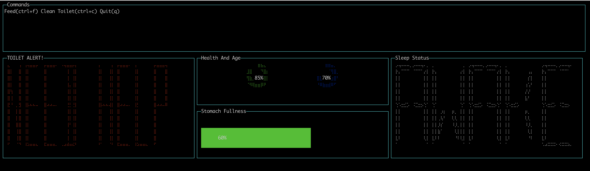
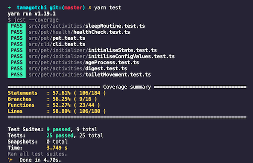

# tamagotchi

The Tamagotchi (たまごっち, IPA: [tamaɡotꜜtɕi]) is a handheld digital pet that was created in Japan

My version of Tamagotchi:
 - it can digest, poop, sleep and wake up on its own.
 - you need to clean the pop and feed it.
 - it will loose its health if poop is not cleaned or stomach is empty
 - it will improve its health if you clean its poop and feed it

Its health is on you now ! 

In addition, it also age by itself just like us. 




#### Run this program on your local
```sh
$ cd tamagotchi
$ nvm use 
$ yarn
$ yarn start 
```
FYI, UI will look better if you run on full size terminal

#### Run tests
```sh
$ yarn test
```


### New Features
 - Add Play Mode
 - Add Feature of Tamagotchi been sick randomly
 - One user can have multiple Tamagotchi to keep 

### To Improve
 - Have a DB to store all logs of user activity
 - We can analyse what is the most popular feature
 - Split each domain into its own service (MicroService)
 - Dockerize the application
 - Write MORE Tests

### Ideas
 - Can become a mobile phone game
